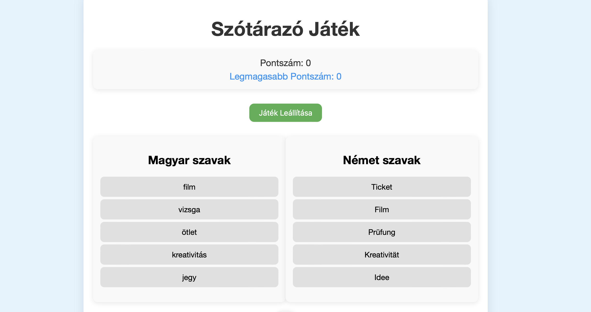

# Szótárazó Játék

Ez egy egyszerű szótár párosító játék, amely magyar-német szópárokat használ. A felhasználó kiválaszt egy magyar és egy német szót, és a program ellenőrzi, hogy azok helyes párosítást alkotnak-e. A cél minél több helyes párosítás létrehozása a lehető legrövidebb idő alatt.




## Fő funkciók:
- Szópárok megjelenítése és párosítása
- Pontszám követése
- Legmagasabb pontszám tárolása
- Játék újraindítása és leállítása

## Telepítés:
1. Klónozd a repót:
   ```bash
   git clone https://github.com/enikoandrea123/szotar_jatek.git

2. Telepítsd a szükséges csomagokat:
   ```bash
   cd dictionary_game

3. Klónozd a repót:
   ```bash
   npm install

4. Játék futtatása helyi szerveren:
   ```bash
   npm start

5. Tesztek futtatása:
   ```bash
   npx jest

### Használat:

A Játék Indítása gomb elindítja a játékot.
Párosítsd a magyar és német szavakat.
A pontszám növekszik minden helyes párosításnál.
A játék újraindítható vagy leállítható a megfelelő gombokkal.

### Technológiák:

- HTML
- CSS
- JavaScript
- Node.js
- Jest - tesztelési keretrendszer